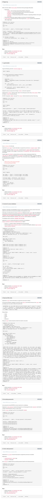

# Personal data
## Resources

* [What Is PII, non-PII, and Personal Data?](https://piwik.pro/blog/what-is-pii-personal-data/)
* [logging documentation](https://docs.python.org/3/library/logging.html)
* [bcrypt package](https://github.com/pyca/bcrypt/)
* [Logging to Files, Setting Levels, and Formatting](https://www.youtube.com/watch?v=-ARI4Cz-awo)

## Tasks

